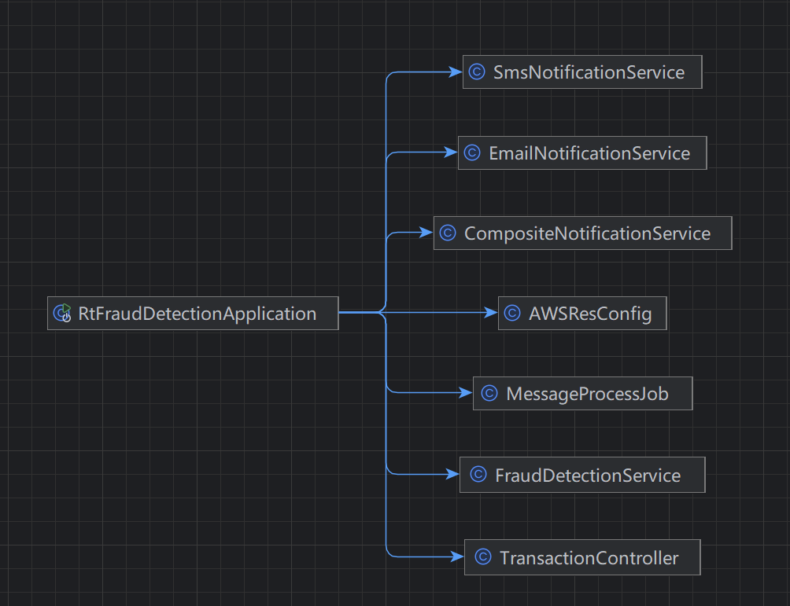

## 项目介绍

## 简介
基于spring boot3 + maven 构造的一个web服务，用于检测金融交易里的可能涉及诈骗的交易。

### 工程化内容

- 工程化较为完备
  - 考虑了多环境的可能，支持多 profile 配置
  - 考虑了容器化运行环境
  - 集成了 github 的 workflow，编译打包、镜像制作

- 考虑了安全问题  
  - 修正了依赖里的安全问题，替换掉有漏洞的依赖版本
  - 使用 jasypt 掩盖了敏感信息保证了一定的安全性

- 功能、性能问题
  - 提供了一个提交交易信息到队列的http接口
  - 采用线程池的方式提交任务，避免每次创建线程。
  - 对消息的处理有确认操作，确保消息是消费了的。
 
### 架构图

### 业务流程图

### 类依赖关系

### spring bean 结构

### 测试报告

 
